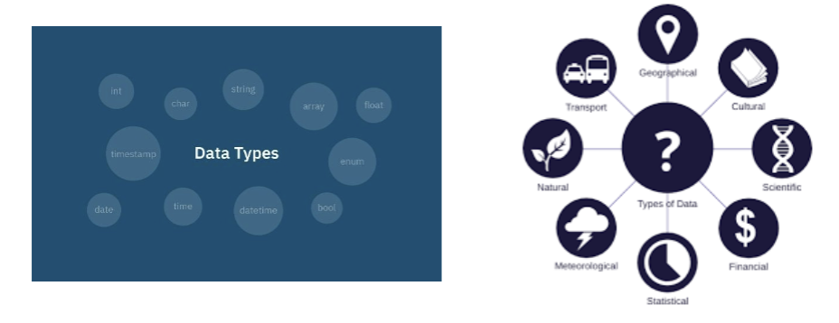
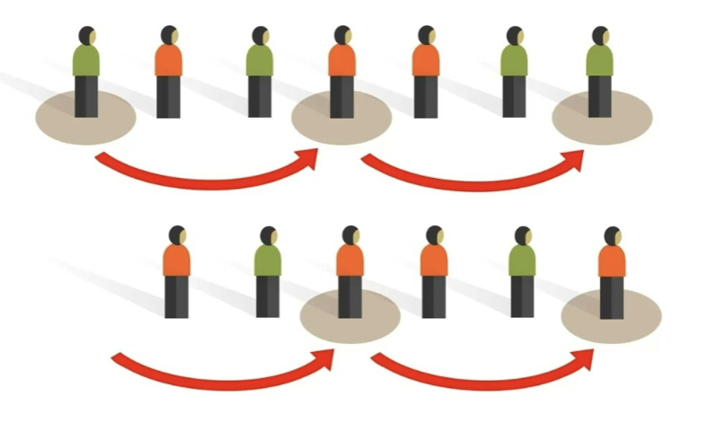

# Day One Aug 20th 2025

## General Information
- Professor Sazib Hasan
- Meeting Times MW 1:30-2:45
- No Textbook
- Final: Mon, Dec 8 @ 1 - 2:50 pm

## Pandas
Is a Python library for data analysis. 
 
[✔️] 
- [ ] Need to download the package

## Why am I here? 
Focus on physics and math over coding in the age of AI

## What is Data? 
- A collection of facts, measurements, or obvservations. 
- In computing/statistics: Information in structured or unstructured form for analysis. 
- EX: Sensor readings, user clicks, customer review

## Role of Data
- <b>Software Engineering</b>: Data Shapes algorithms & system design. 
- EX: Recommendation engines, fraud detection.
- <b>Data Analytics</b>: Extract insights for decision making. 
- EX: A/B testing, market trend analysis

## Types of Data
- Qualitative
- Quantitative
- Measurement Scales
    - Nominal
    - Ordinal
    - Inetrval
    - Ratio

## Common Data Sources
- **Internal:** Databases, logs, sensors.
- **External:** APIs, Open Datasets, Government reports
- **Streaming:** IoT feeds, social media. 
- **Web Scraping for public data**

## Displaying Data
- Tables
- Bar Graph
- Pie Chart
- Histogram
- Scatter Plot

## Sampling 
Gathering information about an entire population often costs too much or is virtually impossible. Instead, we use a sample of the population. A sample should have the same characteristics as the population it is representing. Most statisticians use various methods of random sampling in an attempt to achieve this goal.

### Simple Random Sampling
A straightforward method for selecting a random sample

`import random`
`aList = [20, 40, 80, 100, 120]`
`sampled_list = random.sample(aList, 3)`
`print(sampled_list)`

### Stratified Sample
Population -> Strata -> Randome selection -> Sample

### Cluster Sample 
1. Define the Population
2. Select Clusters
3. Sample Within Clusters
4. Collect Data
5. Analyze Data

### Systematic Sampling

# Stoped at slide 22
